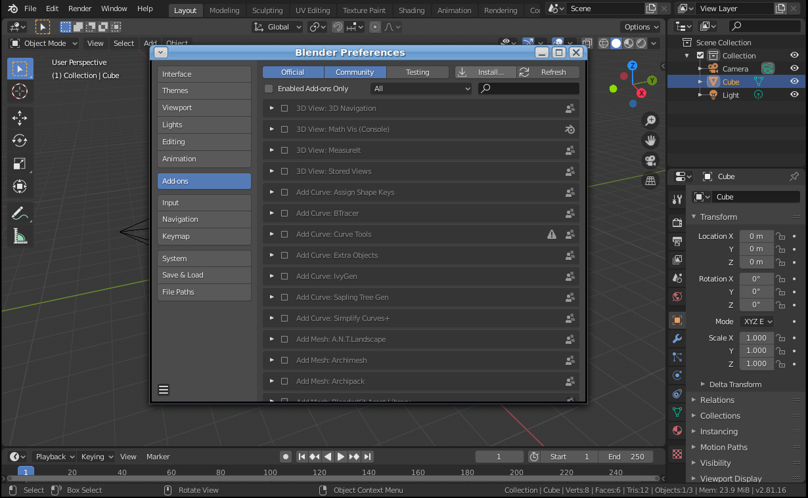
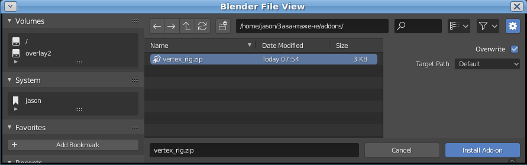
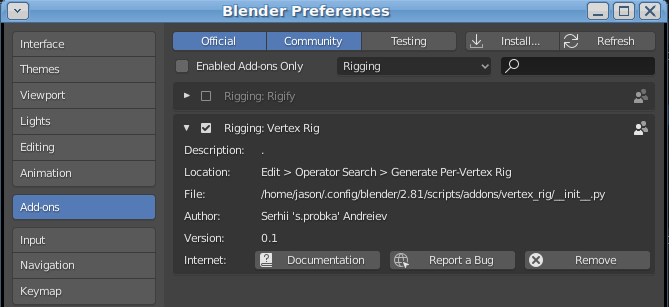
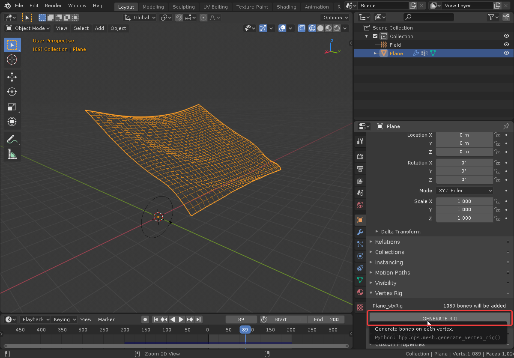
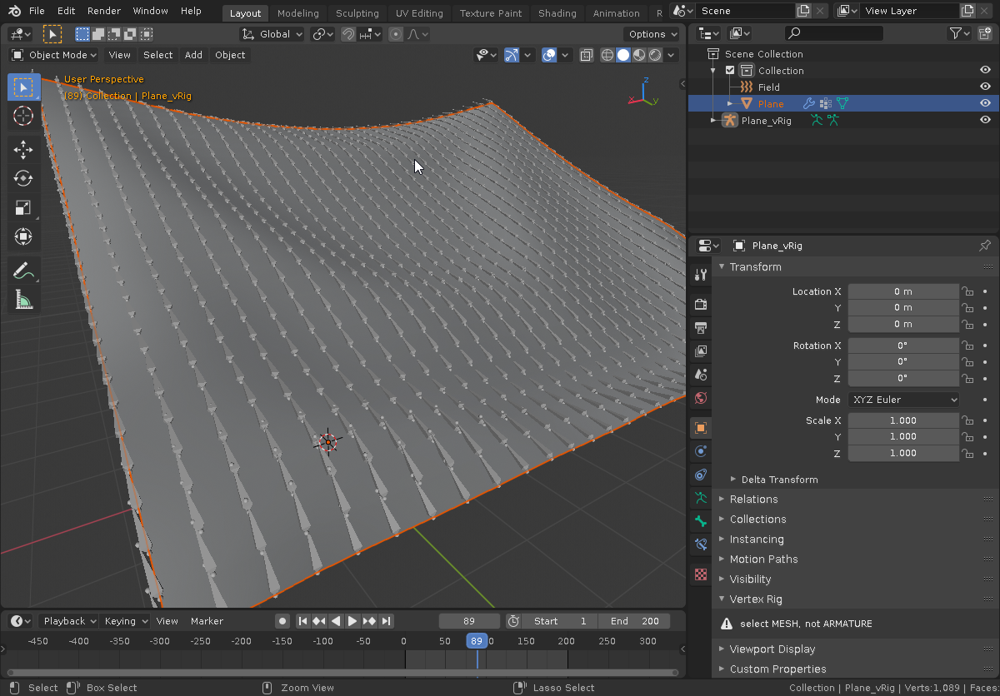
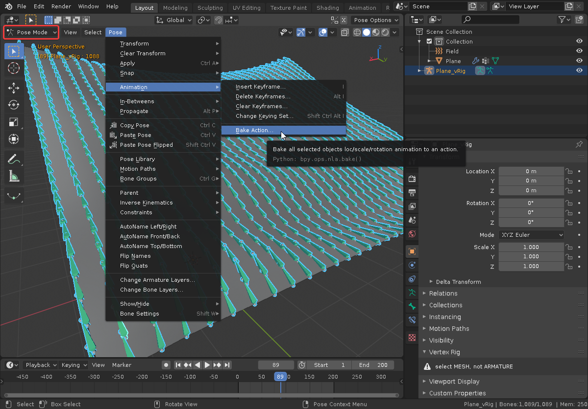
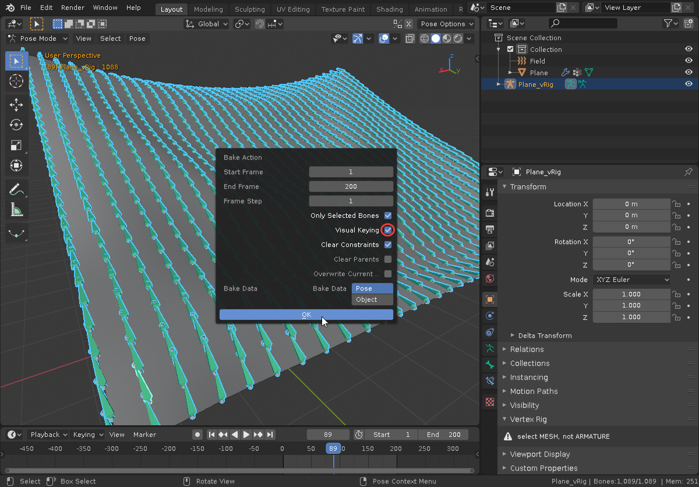
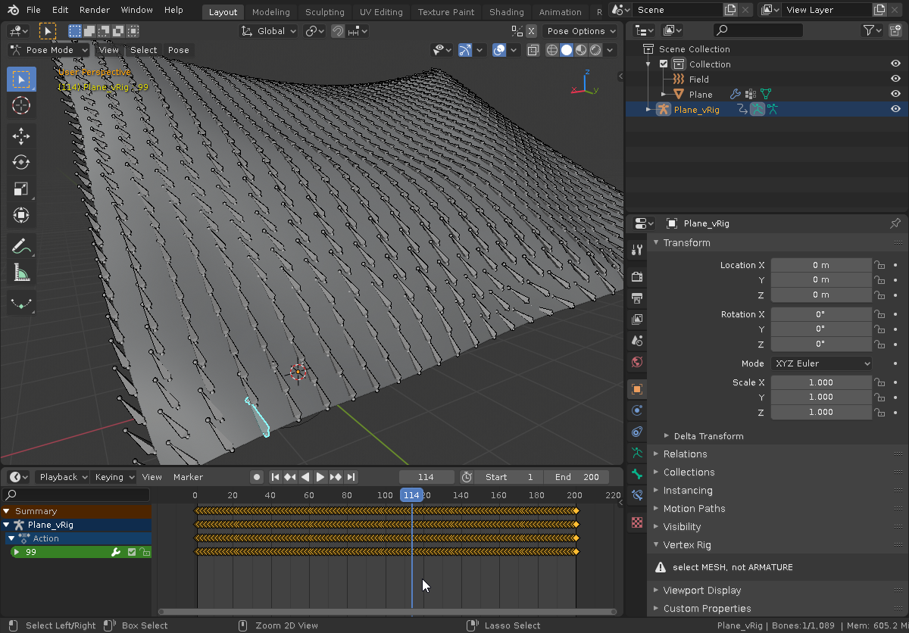

# Vertex Rig Blender Addon

This addon creates a skeleton where each bone is attached to the corresponding vertex of the selected object.
It is suitable for baking animation and subsequent export to game-engine formats.

# How to use
## 1. Download and Install addon

Download [Vertex Rig Addon](https://github.com/probka/VertexRig/releases/download/v1.0/vertex_rig.zip).

In Blender go to menu 'Edit > Preferences', select 'Add-ons', press 'Install' button:

**Locate downloaded addon**

then press checkbox to activate:

If everything fine, Vertex Rig tab will appear in 'Properties/Object' panel when a mesh is selected.

## 2. Generate Armature

Prepare animation for the shape. Then press 'Generate rig' button while Shape is selected.

- **Be careful: using it for hi-poly meshes may take a lot of time. There is no progress bars to estimate the process.**

After addon finishes it's job, you will get a fresh armature with bones constrained to each vertex of the object.

## 3. Baking Animation

For now you can bake animation to keyframes and get action for exporting or blending with other actions:

Select new armature, switch to 'Pose mode', go to menu 'Pose > Animation > Bake action':

Check 'Visual Keying' box and press 'OK'. Wait some time.

After a bit processing you will get your armature with keyframes:

